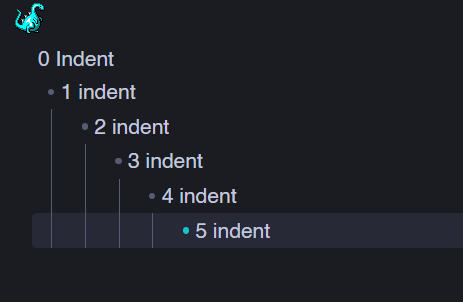

# Heading Handler

Smart heading commands for Obsidian that respect document hierarchy and indentation.



## Features

- **Context-aware heading operations** - Automatically maintains proper heading hierarchy based on parent headings and indentation levels
- **Multi-line selection support** - Apply heading changes to multiple lines at once
- **Works with lists** - Handles headings within bullet lists, numbered lists, and task lists
- **Respects indentation** - Ensures nested content maintains appropriate heading levels relative to parents

## Commands

### Smart Promote Heading

Increases heading level while respecting document structure. If demoting would violate hierarchy (e.g., making a child heading lower than its parent), the heading is clamped to the minimum valid level or removed.

### Smart Demote Heading

Decreases heading level intelligently. When a heading reaches its minimum valid level (based on parent + indent), further demotion removes the heading entirely.

### Increase Heading at Current Line

Simple increment of heading level (1-6), without hierarchy checks.

### Decrease Heading at Current Line

Simple decrement of heading level. Removes heading at level 1.

### Remove Heading

Removes the heading from the current line, preserving the text.

## How It Works

The plugin analyzes document structure to determine parent-child relationships between lines based on:

- **Indentation level** - Tab-based nesting
- **Heading hierarchy** - Parent headings must be lower-numbered than children
- **List context** - Maintains consistency within list structures

Minimum heading level = `max(indentation_depth + 1, parent_heading + 1)`

## Examples

```markdown
# H1 Parent

    ## H2 Child (min: H2)
    	### H3 Grandchild (min: H3)
```

Demoting H3 → H4 → H5 → H6 → (removed)
Promoting (no heading) → H3 → H4 → H5 → H6

## Installation

### From Obsidian Community Plugins

1. Open **Settings → Community plugins**
2. Select **Browse** and search for "Heading Handler"
3. Select **Install**, then **Enable**

### Manual Installation

1. Download `main.js`, `manifest.json`, and `styles.css` from the [latest release](https://github.com/goopii/heading-handler/releases)
2. Create folder `<vault>/.obsidian/plugins/heading-handler/`
3. Copy downloaded files into the folder
4. Reload Obsidian and enable the plugin in **Settings → Community plugins**

## Usage Tips

- Assign hotkeys to smart promote/demote for quick heading adjustments
- Use multi-select to restructure entire document sections
- The "repeatable" flag on smart commands allows holding down the hotkey

## Development

```bash
# Install dependencies
pnpm install

# Build for development (watch mode)
pnpm run dev

# Production build
pnpm run build
```

## Support

If you find this plugin helpful, consider supporting development:

[](https://ko-fi.com/goopii)

## License

MIT License - see LICENSE file for details
